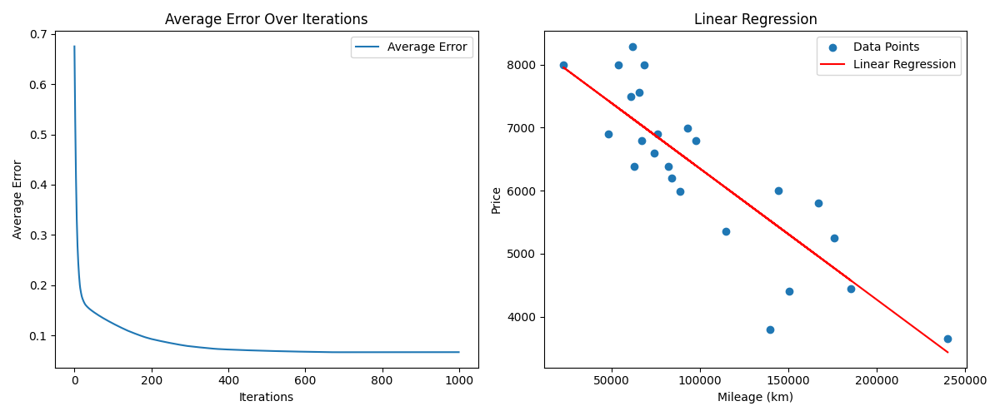

# ft_linear_regression
You will code a program that can predict the price of a car using linear regression with a gradient algorithm.



## Requirements

```bash
pip install -r requirements.txt
```

## Usage

- Predict program:

```bash
python3 predict.py
```

- Learn program:

```bash
python3 learn.py
```
